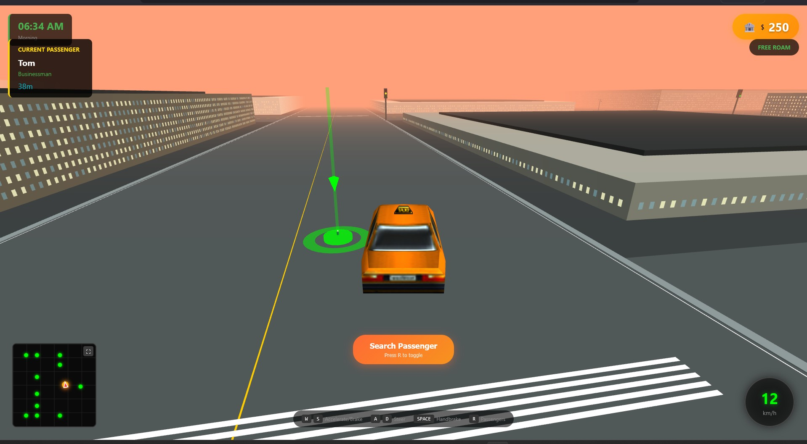

# 🚖 Taxi Simulator - City Drive


---

##  [PROJECT LINK](https://gmt-458-web-gis.github.io/geogame-ibrahimtopcu11/)

---



---

##  About The Project

Taxi Simulator is a 3D browser-based taxi driving game built with Three.js. Drive through a procedurally generated city, pick up passengers, and deliver them to their destinations to earn money and tips.

---

## How To Play

| Key | Action |
|-----|--------|
| **W / ↑** | Accelerate |
| **S / ↓** | Brake / Reverse |
| **A / ←** | Steer Left |
| **D / →** | Steer Right |
| **SPACE** | Handbrake |
| **R** | Open Passenger List |

### Game Flow

1. Press **R** to open the passenger list
2. Select a passenger to pick up
3. Drive to the **GREEN** marker (pickup location)
4. Stop near the marker to pick up the passenger
5. Drive to the **RED** marker (dropoff location)
6. Stop near the marker to complete the ride and earn money

---

##  Tip System

Tips are calculated based on your driving performance. The faster you deliver, the higher the tip!

### Speed Bonuses

| Delivery Speed | Bonus | Tip Rate |
|----------------|-------|----------|
| Super Fast (< 50% expected time) | $50 | 50% |
| Very Fast (< 70% expected time) | $35 | 35% |
| Fast (< 100% expected time) | $20 | 25% |
| On Time (< 130% expected time) | $10 | 15% |
| Slow (> 130% expected time) | $0 | 5% |
| Very Slow (> 200% expected time) | $0 | 0% |

### Passenger Types

| Type | Fare Multiplier | Tip Multiplier |
|------|-----------------|----------------|
| Businessman | 1.5x | 1.8x |
| Tourist | 1.0x | 1.2x |
| Student | 0.8x | 0.6x |

### Time Bonuses

| Time Period | Multiplier |
|-------------|------------|
| Night (20:00 - 06:00) | 1.8x |
| Evening Rush (17:00 - 20:00) | 1.4x |
| Morning Rush (07:00 - 09:00) | 1.3x |

---

##  Game Objective

- Earn as much money as possible by picking up and delivering passengers
- Drive fast but avoid running red lights (-$15 penalty)
- Choose high-tip passengers (Businessmen) for maximum earnings
- Take advantage of night and rush hour bonuses

---

##  Project Structure

```
taxi-simulator/
├── index.html          # Main HTML file with UI elements
├── script.js           # Game logic and Three.js implementation
├── assets/
│   └── taxi.glb        # 3D Taxi model (optional)
└── img/
    └── 1.jpg           # Project screenshot
```

### Key Features

- **Procedural City Generation** - Dynamic city layout with buildings, roads, and parks
- **Day/Night Cycle** - Dynamic sky colors based on game time
- **Traffic Light System** - Functional traffic lights with violation penalties
- **Minimap** - Real-time minimap showing taxi position and destinations
- **Passenger System** - Multiple passenger types with different fare rates

---

##  Technologies Used

- **Three.js** - 3D graphics rendering
- **JavaScript (ES6+)** - Game logic and mechanics
- **HTML5 Canvas** - Minimap rendering
- **CSS3** - UI styling and animations
- **WebGL** - Hardware-accelerated graphics
